# Diagrama de entidades — Clube da Esquerda

Gerado a partir de `packages/database/prisma/schema.prisma`. Renderiza
nativamente em GitHub e em qualquer viewer com suporte a Mermaid.

```mermaid
erDiagram
    USER ||--o| PROFILE : "possui"
    USER ||--o{ REFRESH_TOKEN : "emite"
    USER ||--o{ USER_CONSENT : "aceita"
    USER ||--o{ AUDIT_LOG : "gera (ator)"

    PROFILE ||--o{ PROFILE_BANDEIRA : "tem"
    BANDEIRA ||--o{ PROFILE_BANDEIRA : "associada a"
    PROFILE ||--o{ PROFILE_INTERESSE : "tem"
    INTERESSE ||--o{ PROFILE_INTERESSE : "associado a"

    USER ||--o{ FRIENDSHIP : "solicita/recebe"
    USER ||--o{ BLOCK : "bloqueia/é bloqueado"
    USER ||--o{ SWIPE : "dá/recebe"
    USER ||--o{ MATCH : "participa (A/B)"
    MATCH ||--o| CHAT : "origina"

    CHAT ||--o{ CHAT_PARTICIPANT : "tem"
    USER ||--o{ CHAT_PARTICIPANT : "participa"
    CHAT ||--o{ MESSAGE : "contém"
    USER ||--o{ MESSAGE : "envia"

    RODA ||--o| CHAT : "tem chat de grupo"
    RODA ||--o{ RODA_MEMBRO : "tem"
    USER ||--o{ RODA_MEMBRO : "participa"
    BANDEIRA ||--o{ RODA : "tema de"

    RODA ||--o{ MESA : "organiza"
    EVENTO ||--o{ MESA : "organiza"
    MESA ||--o{ MESA_PARTICIPANTE : "tem"
    USER ||--o{ MESA_PARTICIPANTE : "participa"

    RODA ||--o{ POST : "recebe"
    USER ||--o{ POST : "autora"
    USER ||--o{ REACTION : "reage"
    POST ||--o{ REACTION : "recebe"
    MESSAGE ||--o{ REACTION : "recebe"

    USER ||--o{ EVENTO : "organiza"
    RODA ||--o{ EVENTO : "promove"
    BANDEIRA ||--o{ EVENTO : "tema de"
    EVENTO ||--o{ CONVITE : "gera"
    USER ||--o{ CONVITE : "envia/recebe"
    EVENTO ||--o{ CONFIRMACAO : "recebe"
    USER ||--o{ CONFIRMACAO : "confirma"

    USER {
        uuid id PK
        char64 cpfHash UK "HMAC-SHA256, nunca texto plano"
        string cpfEncrypted "nullable, AES-256-GCM"
        varchar4 cpfLast4
        string email UK
        string passwordHash "Argon2id"
        enum status
        enum role
        int failedLoginAttempts
        datetime lockedUntil
        datetime deletedAt "soft delete / LGPD"
    }

    PROFILE {
        uuid id PK
        uuid userId FK,UK
        string displayName
        date birthDate
        enum gender
        enum visibility
        string city
        string state
    }

    BANDEIRA {
        uuid id PK
        string slug UK
        string name
        boolean active
    }

    INTERESSE {
        uuid id PK
        string slug UK
        string name
        string category
    }

    PROFILE_BANDEIRA {
        uuid profileId PK,FK
        uuid bandeiraId PK,FK
        int priority
    }

    PROFILE_INTERESSE {
        uuid profileId PK,FK
        uuid interesseId PK,FK
    }

    FRIENDSHIP {
        uuid id PK
        uuid requesterId FK
        uuid addresseeId FK
        string canonicalKey UK "min(id):max(id)"
        enum status
    }

    BLOCK {
        uuid id PK
        uuid blockerId FK
        uuid blockedId FK
    }

    SWIPE {
        uuid id PK
        uuid userId FK
        uuid targetId FK
        boolean liked
    }

    MATCH {
        uuid id PK
        uuid userAId FK "sempre menor UUID"
        uuid userBId FK "sempre maior UUID"
        enum status
    }

    CHAT {
        uuid id PK
        enum type "DIRECT | GROUP"
        uuid matchId FK,UK "nullable"
        uuid rodaId FK,UK "nullable"
    }

    CHAT_PARTICIPANT {
        uuid chatId PK,FK
        uuid userId PK,FK
        datetime lastReadAt
    }

    MESSAGE {
        string id PK "ULID/UUIDv7, ordenável"
        uuid chatId FK
        uuid senderId FK
        enum type
        text content
        datetime createdAt
    }

    RODA {
        uuid id PK
        string slug UK
        string name
        uuid bandeiraId FK "nullable"
        enum visibility
    }

    RODA_MEMBRO {
        uuid rodaId PK,FK
        uuid userId PK,FK
        enum role
    }

    MESA {
        uuid id PK
        uuid rodaId FK "nullable"
        uuid eventoId FK "nullable"
        string name
        int capacity
    }

    MESA_PARTICIPANTE {
        uuid mesaId PK,FK
        uuid userId PK,FK
    }

    POST {
        uuid id PK
        uuid authorId FK
        uuid rodaId FK "nullable = mural pessoal"
        text content
        enum visibility
    }

    REACTION {
        uuid id PK
        uuid userId FK
        enum targetType "POST | MESSAGE"
        uuid targetId
        enum type
    }

    EVENTO {
        uuid id PK
        string title
        enum tipo "PRESENCIAL | ONLINE | CLUBE | ANALISE"
        enum status
        uuid organizerId FK
        uuid rodaId FK "nullable"
        uuid bandeiraId FK "nullable"
        datetime startsAt
        int capacity
        int confirmedCount "contador desnormalizado"
    }

    CONVITE {
        uuid id PK
        uuid eventoId FK
        uuid inviterId FK
        uuid inviteeId FK
        enum status
    }

    CONFIRMACAO {
        uuid id PK
        uuid eventoId FK
        uuid userId FK
        enum status "CONFIRMED | WAITLISTED | CANCELLED | CHECKED_IN"
    }

    REFRESH_TOKEN {
        uuid id PK
        uuid userId FK
        string tokenHash UK
        datetime expiresAt
        datetime revokedAt
    }

    USER_CONSENT {
        uuid id PK
        uuid userId FK
        enum type
        string version
    }

    AUDIT_LOG {
        uuid id PK
        uuid actorId FK "nullable"
        string action
        string targetType
        string targetId
    }
```

## Notas de leitura do diagrama

- `MATCH` e `CHAT` são 1:1 opcional — nem todo match tem chat criado
  instantaneamente (a criação do `Chat` acontece na mesma transação que
  vence a corrida de criação do `Match`, ver `docs/contexto.md` §3.2),
  mas a modelagem permite chats de grupo (`RODA` → `CHAT`) usando a
  mesma tabela `CHAT` com `type = GROUP`.
- `REACTION` tem `targetType`/`targetId` polimórfico para cobrir posts e
  mensagens com uma única tabela; as FKs tipadas (`postId`, `messageId`)
  são nulháveis e mantidas em paralelo para permitir joins tipados do
  Prisma — ver comentário `DECISÃO` no schema.
- `MESA` pode pertencer a uma `RODA` (mesa permanente de um grupo
  temático) **ou** a um `EVENTO` (mesa pontual de um encontro) — os dois
  FKs são opcionais e mutuamente ilustrativos do mesmo conceito em
  contextos diferentes.
